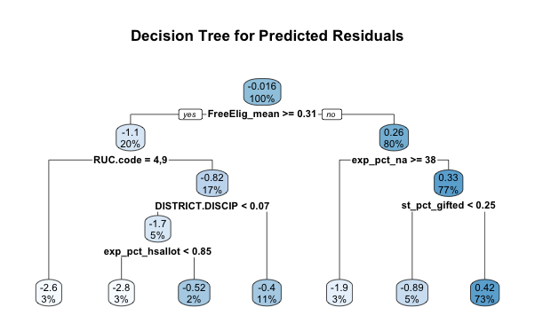

## Introduction
  The subject of school performance has been heavily researched in the past with most studies coming to the conclusion that household income and racial/ethnic demographics are the most predictive factors of school performance. Students who come from households with predominantly high socioeconomic status tend to perform better than their peers who come from lower socioeconomic circumstances - this trend further aggregates to the school and district level with schools located in neighborhoods of higher socioeconomic status typically outperforming those in poorer areas, as measured by metrics such as standardized test scores, graduation rates, and college acceptance rates. However, in a state as racially diverse as Texas, how well do these trends explain over versus under-performance at the district level? In this report, we will analyze district-level data gathered from the Texas Education Agency during the 2019 to 2020 school year covering student and faculty demographics, SAT/ACT test scores, median household income, enrollment, and graduation rates. From this data, we will identify districts that over or under perform their predicted outcome score and use machine learning techniques to analyze the correlated variables responsible. By doing so, we hope to uncover the key factors that make a district out or under perform other districts with similar demographic makeup. By doing so, we will hopefully deepen our understanding of school performance and use our findings to narrow the achievement gap between districts in Texas and beyond. 

## Methods
  The subject of school performance has been heavily researched in the past with most studies coming to the conclusion that household income and racial/ethnic demographics are the most predictive factors of school performance. Students who come from households with predominantly high socioeconomic status tend to perform better than their peers who come from lower socioeconomic circumstances - this trend further aggregates to the school and district level with schools located in neighborhoods of higher socioeconomic status typically outperforming those in poorer areas, as measured by metrics such as standardized test scores, graduation rates, and college acceptance rates. However, in a state as racially diverse as Texas, how well do these trends explain over versus under-performance at the district level? 
  
## Data
  The Data we used for our analysis was gathered primarily from the TEA, USDA, and the Census. We gathered TEA data on educational outcomes (Graduation Rates, Standardized Test Scores, Attendance, etc.), and school-district-level covariates (Student-Teacher Ratio, Teacher Pay, Disciplinary Activity, School Meals, etc.). We merged these variables onto socioeconomic indicators such as poverty rate, median income, and education levels. This aggregation had to be done at the county level, which means some researcher bias had to be introduced when deciding how to most appropriately aggregate outcomes data gathered at the district level up to the county level. All said, we had 87 covariates for analysis on 8 outcome variables:
* `ERW`: Average SAT evidence-based reading and writing score
* `MATH`: Average SAT mathematics score
* `TOTAL`: Average SAT total score
* `ann_grad_count_1819`: The number of students who graduated during the 2018-19 school year, including the summer of 2019. This count includes 12th grade graduates, as well as graduates from other grades.
* `avg_sat_1819`: The average of SAT total scores (a sum of evidence-based reading and writing and mathematics) for 2018-19 graduates who took the SAT divided by the number of 2018-19 graduating SAT examinees. Total scores for the SAT range from 400 to 1600 for evidence-based reading and writing and mathematics combined. Total score for each examinee is calculated based on the best section scores from all SAT tests taken by the examinee anytime during their high school years.
* `avg_act_1819`: The average of ACT composite scores (an average of English, mathematics, reading, and science), created by summing the composite scores for 2018-19 graduates who took the ACT divided by the number of 2018-19 graduating ACT examinees. Scores on each of the ACT sections range from 1 to 36.
* `Above_Crit_Rate`: Percent of graduating examinees receiving SAT total scores of 1180 or higher
* `Above_TSI_Both_Rate`: Percent of graduating examinees meeting the college-ready graduates TSI criteria for the SAT on both ELA and mathematics
  An unfortunate issue when it comes to using Education data from a data analytics perspective is the issue of "Masking". Because of privacy considerations, schools must take care to not release any data that could be potentially used to identify specific students. As an example, if there are only a handful of Hispanic students in a given school, the school might have to mask any statistics on the racial/ethnic breakdown of educational outcomes in order to prevent the possibility that the data can be easily used to find the scores, economic, or disciplinary status of specific students. In aggregate, this means that there are a significant number of N/As and masked codes that had to be dealt with in order to proceed with the analysis. As a result, our data is biased slightly in favor of being more accurate for schools with larger, more diverse school populations, and may not capture all the useful variation for smaller school districts. However, given that this is a limitation with all publicly available, and our goal was to identify which patterns/abnormalities in the data we *could* see, rather than a more rigorous causal analysis, this seemed to us an acceptable constraint.

## Analysis
To start our analysis, we first merged our data and then created an aggregated "outcome" variable to measure district performance across a variety of metrics including SAT ERW and Math scores, previous year graduation rate, previous year SAT and ACT scores, and percentages of graduating students meeting the college-ready measures for SAT scores. To create this outcome variable, Principle Component Analysis (PCA) of rank 1 was used to reduce the dimensionality of our outcome variables and create one PC of weights that maximizes the variance found in the original outcome data. The resulting PC1 in Table 1 shows large weights from every performance metrics, with the minimal exception of previous year graduation rate. 
```{r analysis, echo = FALSE, warning = FALSE, message = FALSE, results = 'asis'}
if (!("librarian" %in% rownames(utils::installed.packages()))) {
  utils::install.packages("librarian")}
librarian::shelf(tidyverse, haven, kable, kableExtra, modelr, rsample, stargazer)

testing = read.csv("r_objects/testing.csv")
outcomes_PCA_table = prcomp(testing[,(1:8)], scale=TRUE, rank=1)
data.frame(outcomes_PCA_table$rotation) %>% kbl(booktabs = T, format = 'latex', digits = 4, caption = "PCA of performance metrics") %>% kable_classic(full_width = F, html_font = "Cambria") %>% kable_styling(latex_options = 'hold_position')
```
### OLS Model
Next, we fit the loadings of PC1 on to our original district-level data resulting in a singular outcome performance variable. The next step in our analysis was to create a simple linear OLS regression of our new weighted outcome variable on a selection of covariates believed to be most indicative of performance based on previous literature. These features included median household income measured as a percent of the statewide median, the child poverty rate in each county, average faculty salary, along with percentages for student population by race (Black, Hispanic, White, Asian, Native American, Pacific Islander, and multi-racial). Child poverty percent effects has both the resources a child has access to and is associated with other deviant behavior like truancy. Percent state median income defines the percent of the mean income for the county of the states median income. For instance, a county with 1.5 is a county with a mean income 50% higher than the state median. Average school salary describes the amount of resources that are going to schools. As observed in the model results in Table 2, we find that percent of state median household income and average school salary are highly statistically significant in predicting district performance. This result supports other studies on the subject, however, this does not explain why some school districts who would be predicted to perform at a certain level do not. These districts are represented in the residuals of our linear model, which we will next use as the outcome variable in a series of machine learning models. 

```{r ols, echo = FALSE, message=FALSE, warning = FALSE, results = 'asis'}
load("r_objects/lin_mod.RData")
stargazer(lin_mod, header = FALSE, title = "Linear Model - PC1")
```

### Decision Tree
For our decision tree and random forest models, we first scaled our variables that used counts as to normalize based on student enrollment in each district. Then, a decision tree was fitted with our residuals from the OLS model as the outcome variable of interest. As seen in Figure 1, the most important split was on previous year's total expenditure per student, with districts spending more per student having higher residuals, i.e. over performing their predicted performance. Interestingly, the model did not pick up current year's expenditure per student as a significant split, although a high "fund balance", or the remaining district funds at the end of the school year, was the next significant predictor for overperforming schools. Next, we observe average salary for central faculty (i.e. Principals, Vice Principals, and other administrative positions), with a lower salary indicating negative residuals, or underperformance. Racial diversity was another significant factor with 



```{r tree, file = "code/decision_tree.R", echo = FALSE, message=FALSE, warning=FALSE, results = 'asis'}
load("r_objects/tree_vip.Rdata")

tree_vip %>% kable(booktabs = T, format = "latex", caption = "CART: Variable Importance") %>% kable_classic(full_width = F, html_font = "Cambria") %>% kable_styling(latex_options = 'hold_position')
```

### Random Forest
To further deepen the model, we next split our data into districts with positive and negative residuals, representing districts that over performed relative to their predicted performance and those who under performed relative to their predicted performance. We used random forests of 50 trees to identify the features most predictive of an over or under performing district and created variable importance plots to visualize the partial dependence of the most important variables for over and under performing districts. For the over performing school districts with positive residuals, we found the most important feature to be unemployment in 2020, with 
```{r rf_over, file = "code/randomForest_new.R", results = 'asis', message = FALSE, echo = FALSE, warning = FALSE}
load("r_objects/rf_over_vip.Rdata")

# vip table
rf_over_vip %>% kbl(booktabs = T, format = "latex", caption = "Random Forest: Variable Importance for Overperforming Districts") %>% kable_classic(full_width = F, html_font = "Cambria") %>% kable_styling(latex_options = 'hold_position')

# top 5 partial dependence plots 
feats = rf_over_vip[,1]
par(mfrow = c(3,2))
for (i in feats){
plot = partial(rf, pred.var = i, plot = TRUE, plot.engine = "ggplot2") + 
  ggtitle(paste("Partial Dependence Plot of ", i)) + 
  xlab(paste(i)) + 
  ylab("Predicted Resid")
print(plot)
}
```


## Findings

## Conclusion